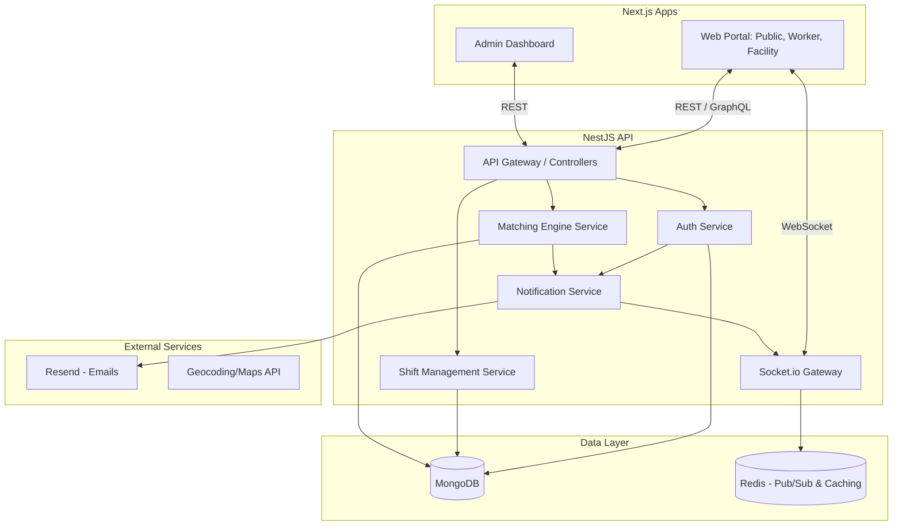

# System Architecture Specification: MedShift

## 1. Overview
MedShift is built as a **Monorepo** to promote code sharing, maintainability, and consistency across the stack. The application consists of Next.js frontends (Public/Facility/Worker portals and Admin dashboard) and a NestJS backend API, powered by a MongoDB database.

The architecture adheres to **SOLID** principles, ensuring that components are modular, decoupled, and easily testable.

## 2. High-Level Architecture Diagram


## 3. Monorepo Structure (Nx / Turborepo)
```
medshift/
├── apps/
│   ├── web/               # Next.js: Public landing, Worker portal, Facility portal
│   ├── admin/             # Next.js: Admin dashboard
│   └── api/               # NestJS: Core backend services
├── packages/
│   ├── shared-types/      # TypeScript interfaces, enums shared across stack
│   ├── ui-components/     # Reusable React components (Design System)
│   └── utils/             # Shared validation, formatting utilities
└── package.json
```

## 4. Backend Architecture (NestJS)
The NestJS application follows a strict modular and layered architecture to enforce SOLID principles.

### Layered Approach
1. **Controllers / Gateways (Interface Layer)**: Handle HTTP requests and WebSocket connections. Route data to services.
2. **Services (Business Logic Layer)**: Contain the core business logic (e.g., Shift Matching). Single Responsibility Principle (SRP) is enforced by keeping services focused (e.g., `ShiftService` handles CRUD, `MatchingService` handles the algorithm).
3. **Repositories (Data Access Layer)**: Abstract Mongoose/MongoDB interactions. Dependency Inversion Principle (DIP) is applied by depending on repository interfaces rather than concrete database implementations.

### Core Modules
- **`AuthModule`**: Handles registration, login, JWT authentication, email verification token creation/validation, verification resend flows, password reset token creation/validation, password updates, and RBAC (Role-Based Access Control) for Workers, Facilities, and Admins.
- **`UserModule`**: Manages user profiles, credentials, and background check statuses.
- **`FacilityModule`**: Manages facility profiles, billing setup, and locations.
- **`ShiftModule`**: Manages shift lifecycle (creation, publishing, completion, cancellation).
- **`MatchingModule`**: Uses geospatial queries (MongoDB `$near`) and worker availability to find matches.
- **`NotificationModule`**: Adapters for Email (Resend) and Real-time (Socket.io), including registration verification emails, password reset emails, welcome emails, and shift notifications. Open/Closed Principle (OCP) applies here: new notification channels (e.g., SMS) can be added without modifying existing code.

### Authentication Flow
1. **Start Registration**: The API accepts an email address, stores a hashed six-digit OTP with an expiration timestamp, and asks `NotificationModule` to send the code through Resend.
2. **Verify Registration OTP**: The API validates the OTP hash and expiration, marks the registration attempt verified, and returns a short-lived registration completion token.
3. **Complete Registration**: The API validates the completion token, creates the user with password and account type, marks `emailVerified` as `true`, clears the registration attempt, and returns a JWT session.
4. **Legacy Email Links**: Existing email verification token handling remains available for pending accounts created before the OTP flow.
5. **Login Gate**: Login rejects unverified users with a verification-required response so the web app can show a resend option instead of a generic failure.
6. **Resend Verification**: The API rotates the token and sends a new verification email without exposing whether an email belongs to an account.
7. **Forgot Password**: The API accepts an email address, returns a generic success response, and if the account exists, stores a hashed reset token with an expiration timestamp and asks `NotificationModule` to send a reset link.
8. **Reset Password**: The API validates the reset token hash and expiration, updates the stored password hash, clears reset token fields, and returns a success response without issuing a session automatically.
9. **Feedback Contract**: Auth endpoints should return stable machine-readable error codes for expected states such as `EMAIL_VERIFICATION_REQUIRED`, `REGISTRATION_OTP_INVALID`, `PASSWORD_RESET_INVALID`, and `PASSWORD_RESET_EXPIRED` so the web app can show specific inline and toast feedback.

## 5. Frontend Architecture (Next.js)
- **App Router & Server Components**: Leverages React Server Components (RSC) for initial page loads (SEO, performance) and Client Components for interactive pieces (e.g., Real-time shift boards).
- **State Management**: React Query (for server state and caching) and Zustand/Context (for lightweight client state like UI toggles).
- **Component Design**: 
  - Dumb/Presentational components in `packages/ui-components`.
  - Smart/Container components in `apps/web/features/*`.
- **Action Feedback**: Frontends must expose a shared toast/notification provider that works in Next.js client components. Use it for non-blocking success/error feedback and pair it with inline form messages for auth actions. Native browser `alert()`, `confirm()`, and blocking prompts are not permitted in product workflows.

## 6. Real-Time Infrastructure (Socket.io)
- **Namespaces & Rooms**: Connections are organized by namespaces (e.g., `/shifts`) and rooms (e.g., `facility_123` or `geo_calgary`).
- **Events**:
  - `shift.created`: Broadcasted to qualified workers in the geographical area.
  - `shift.accepted`: Notifies the facility immediately when a worker accepts.
  - `worker.status_update`: Updates worker availability in real-time.
